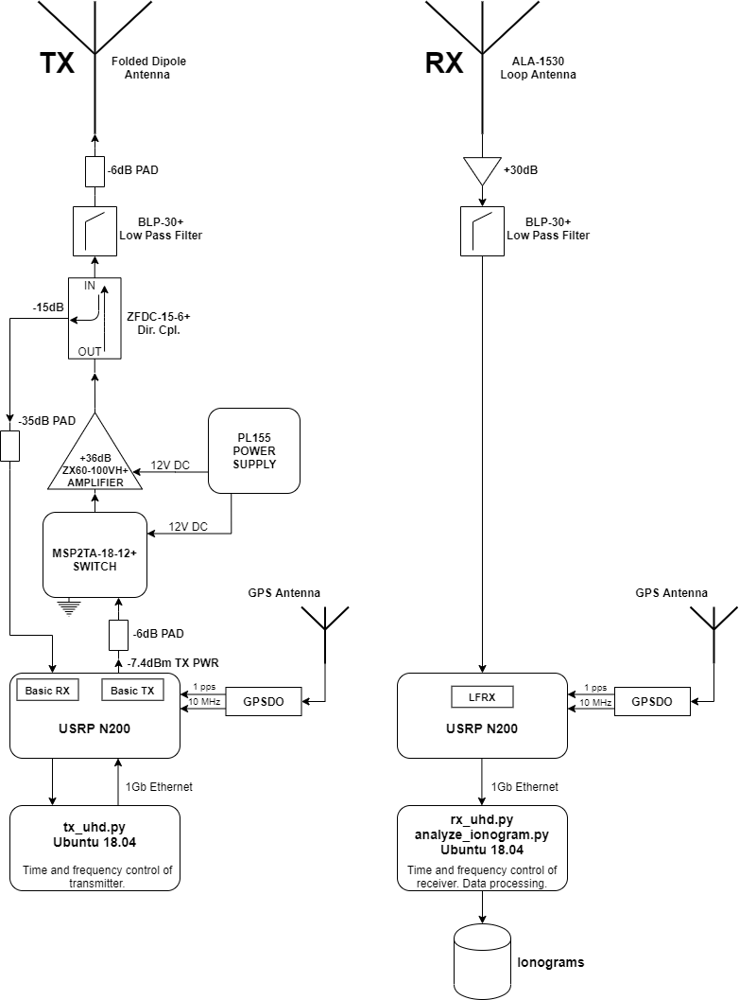

# Coded continuous-wave ionosonde 

(c) 2012-2020 Juha Vierinen, Markus Floer, Mikko Syrjäsuo

A basic software defined radio ionosonde implementation written purely in Python. The ionosonde uses arbitrary transmit waveforms, which can be defined by the user. The default configuration uses pseudorandom phase coded continuous wave pulses. 

On receive, a range-Doppler spectrum of the received echoes is estimated and an ionogram is produced using the configured frequency sweep. 

The software is released under the GPL 3.0 license. 

## Hardware

The software relies on USRP N2x0 software defined radio hardware. The minimum requirement is:
- Ettus Research USRP N2x0 + internal GPSDO with BasicRX or LFRX daughterboard for receiving
- Ettus Research USRP N2x0 + internal GPSDO with BasicRX or LFRX daughterboard for receiving and BasicTX or LFTX daugherboard of transmitting. The receiver card on the transmitter can be used to measure relfected or transmitted power using a directional coupler.
- You choice of transmit and receiver antennas, and associated RF plumbing. An example is shown below.

## Software dependencies

- Requires Linux. We've tested the program using Ubuntu 18.04 LTS. 
- Requires UHD Library 3.15. The UHD library needs to be compiled with the Python API enabled. 
- Numpy, Matplotlib, Scipy, Psutil

## Installation Instructions

Installing UHD 3.15 with Python API enabled

> sudo apt-get install libopenblas-dev python3-matplotlib python3-psutil python3-h5py python3-setuptools
> sudo apt-get -y install git swig cmake doxygen build-essential libboost-all-dev libtool libusb-1.0-0 libusb-1.0-0-dev libudev-dev libncurses5-dev libfftw3-bin libfftw3-dev libfftw3-doc libcppunit-1.14-0 libcppunit-dev libcppunit-doc ncurses-bin cpufrequtils python-numpy python-numpy-doc python-numpy-dbg python-scipy python-docutils qt4-bin-dbg qt4-default qt4-doc libqt4-dev libqt4-dev-bin python-qt4 python-qt4-dbg python-qt4-dev python-qt4-doc python-qt4-doc libqwt6abi1 libfftw3-bin libfftw3-dev libfftw3-doc ncurses-bin libncurses5 libncurses5-dev libncurses5-dbg libfontconfig1-dev libxrender-dev libpulse-dev swig g++ automake autoconf libtool python-dev libfftw3-dev libcppunit-dev libboost-all-dev libusb-dev libusb-1.0-0-dev fort77 libsdl1.2-dev python-wxgtk3.0 git libqt4-dev python-numpy ccache python-opengl libgsl-dev python-cheetah python-mako python-lxml doxygen qt4-default qt4-dev-tools libusb-1.0-0-dev libqwtplot3d-qt5-dev pyqt4-dev-tools python-qwt5-qt4 cmake git wget libxi-dev gtk2-engines-pixbuf r-base-dev python-tk liborc-0.4-0 liborc-0.4-dev libasound2-dev python-gtk2 libzmq3-dev libzmq5 python-requests python-sphinx libcomedi-dev python-zmq libqwt-dev libqwt6abi1 python-six libgps-dev libgps23 gpsd gpsd-clients python-gps python-setuptools

> wget https://github.com/EttusResearch/uhd/archive/v3.15.0.0.tar.gz
> tar xvfz v3.15.0.0.tar.gz
> cd uhd
> cd host
> mkdir build
> cd build
> cmake -DENABLE_PYTHON_API=ON ../
> make 
> sudo make install
